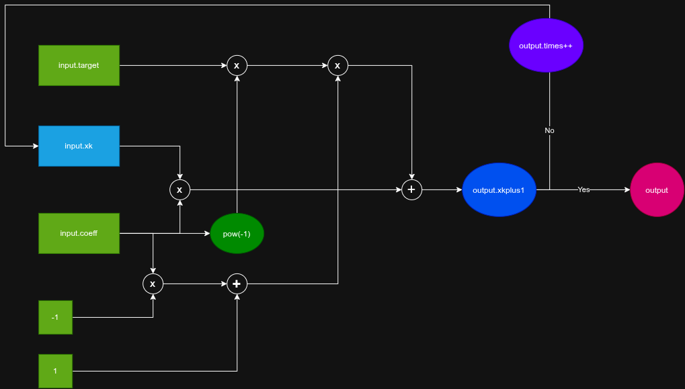

# Recursive for Sqrt
---
## Algorithm
<center>
    
</center>

## Coding
```C++
#include<iostream>
#include<cmath>

using namespace std;

// constant
const int level = 12;
const double error = pow(10,-level);

// input and output structure
struct input{
	double target;
	double xk;
	double coeff;
} ini;
struct output{
	int times;
	double xkplus1;
} fin;

// function prototype
output Iter(input* ini);

// main function
int main(void){

	// output setting
	cout.setf(ios::fixed, ios::floatfield);
	cout.precision(level);

	// initialization
	double reset;
	cout << "Enter a positive number to calculate the square root: ";
	cin >> ini.target;
	cout << "Enter an initial value that is greater than 0: ";
	cin >> ini.xk;
	reset = ini.xk;

	// iteration
	cout << "Enter a coefficient to iterate and enter 'q' to quit: ";
	while(cin >> ini.coeff){
		fin=Iter(&ini);
		cout << "Result: " << fin.xkplus1 << endl;
		cout << "Times: " << fin.times << endl;
		ini.xk = reset;
		cout << "Enter a coefficient to iterate and enter 'q' to quit: ";
	}

	return 0;
}

// recursive function
output Iter(input* ini){

	output fin;
	
	// iteration
	fin.xkplus1 = 
		(ini->coeff)*(ini->xk) + 
		(1-(ini->coeff))*(ini->target)/(ini->xk);

	// test
	if(fabs((ini->xk)-(fin.xkplus1))<error){
		fin.times = 1;
		return fin;
	}
	else{
		ini->xk = fin.xkplus1;
		fin = Iter(ini);
		++fin.times;
		return fin;
	}
}
```

## Results
```Console
Enter a positive number to calculate the square root: 2
Enter an initial value that is greater than 0: 1.5
Enter a coefficient to iterate and enter 'q' to quit: 0.5
Result: 1.414213562373
Times: 5
Enter a coefficient to iterate and enter 'q' to quit: 0.6
Result: 1.414213562373
Times: 17
Enter a coefficient to iterate and enter 'q' to quit: 0.4
Result: 1.414213562373
Times: 17
Enter a coefficient to iterate and enter 'q' to quit: 0.3
Result: 1.414213562373
Times: 29
Enter a coefficient to iterate and enter 'q' to quit: 0.7
Result: 1.414213562374
Times: 28
Enter a coefficient to iterate and enter 'q' to quit: 0.8
Result: 1.414213562374
Times: 49
Enter a coefficient to iterate and enter 'q' to quit: 0.2
Result: 1.414213562373
Times: 52
Enter a coefficient to iterate and enter 'q' to quit: 0.1
Result: 1.414213562373
Times: 117
Enter a coefficient to iterate and enter 'q' to quit: 0.9
Result: 1.414213562377
Times: 107
Enter a coefficient to iterate and enter 'q' to quit: 0.01
Result: 1.414213562374
Times: 1280
Enter a coefficient to iterate and enter 'q' to quit: 0.99
Result: 1.414213562422
Times: 1055
Enter a coefficient to iterate and enter 'q' to quit: q
```
